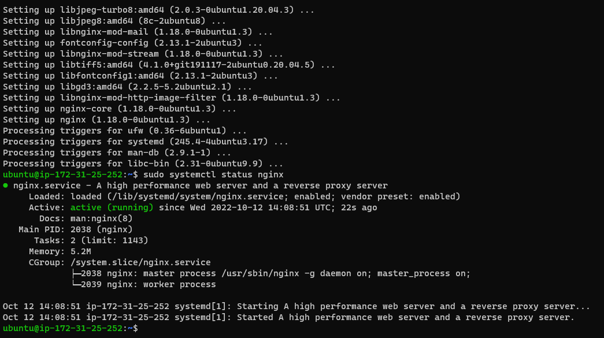
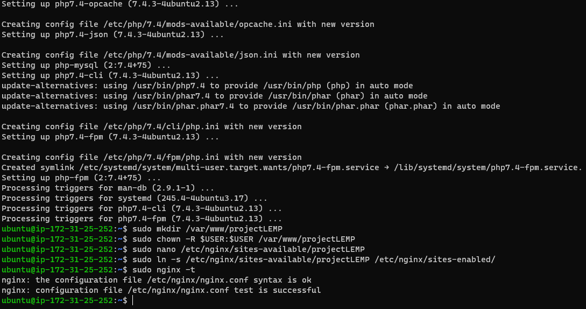
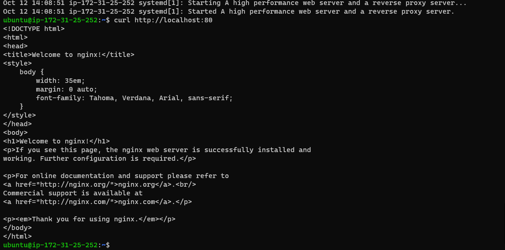
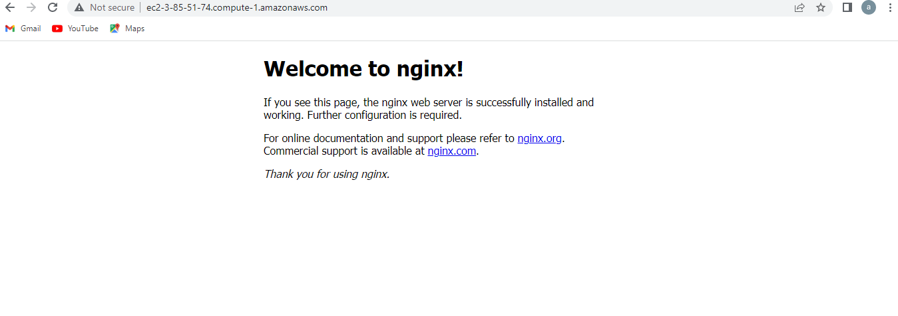
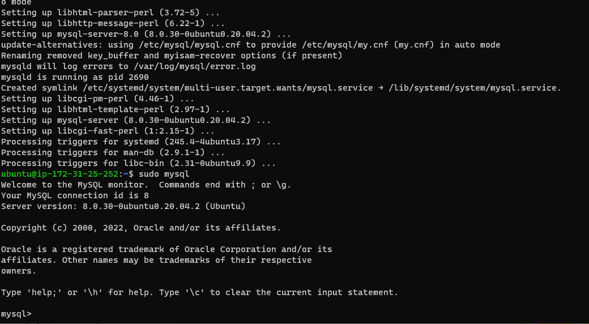
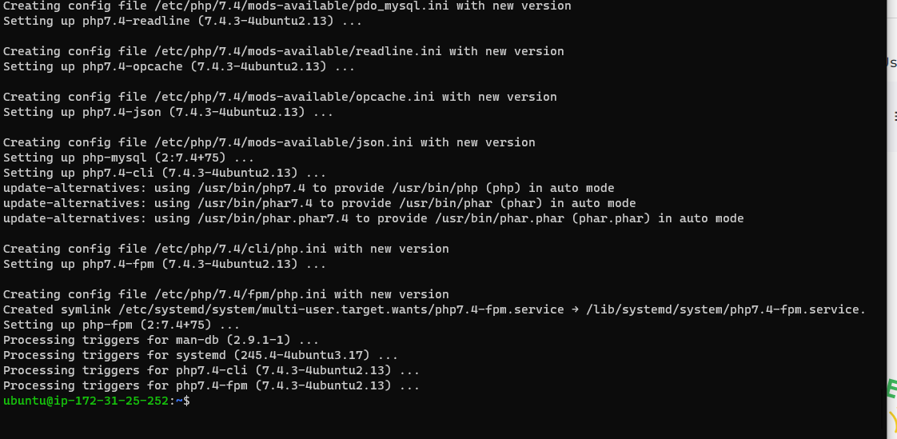
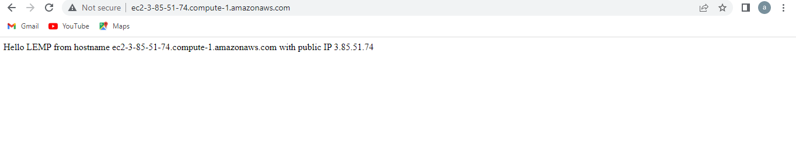
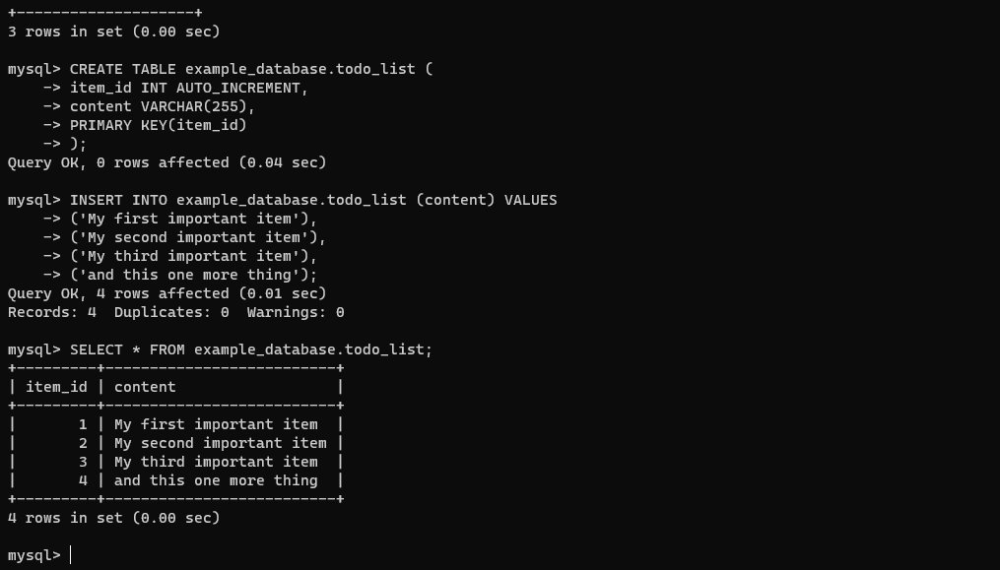
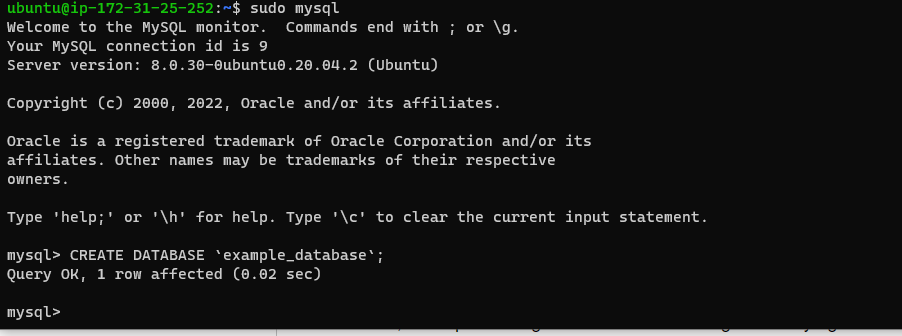
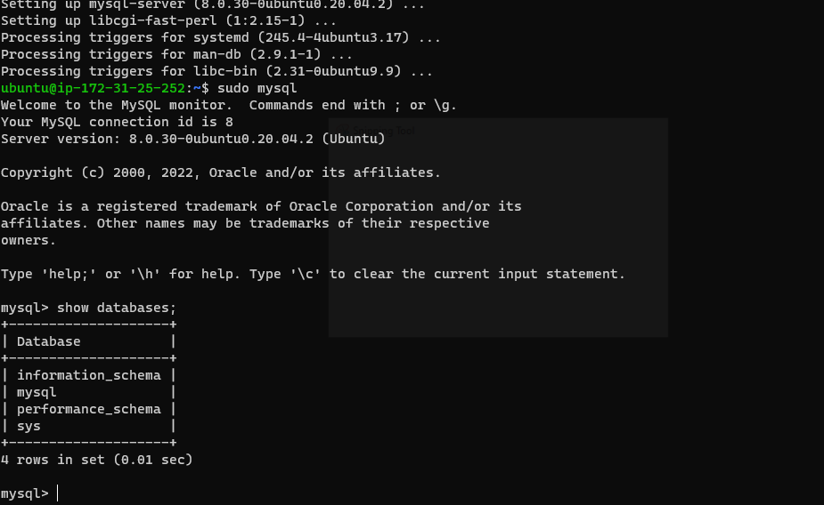

**PROJECT 2: LEMP STACK IMPLEMENTATION**

**installing Nginx**

**sudo apt install nginx**

**To verify that nginx was successfully installed**

**sudo systemctl status nginx**

**Accessing it locally in our Ubuntu shell**

**http://localhost:80**

****

****

**installing mysql server**

**sudo apt install mysql-server**

****

**INSTALLING PHP**

**sudo apt install php-fpm php-mysql**

**

**Configuring Nginx to Use PHP Processor**

****

**RETRIEVING DATA FROM MYSQL DATABASE WITH PHP**

****

****

****

